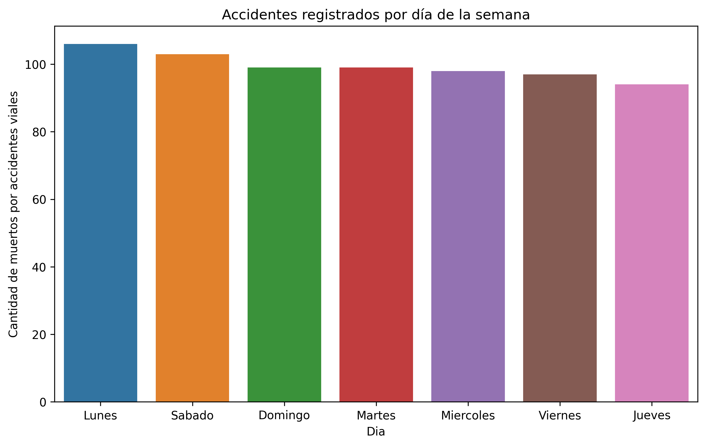
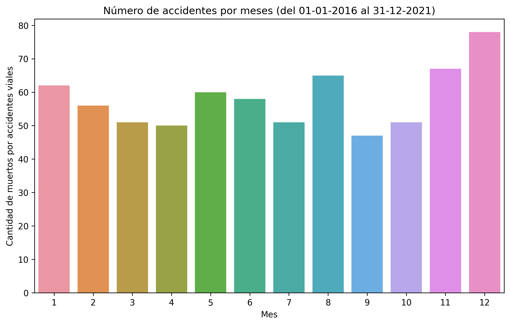
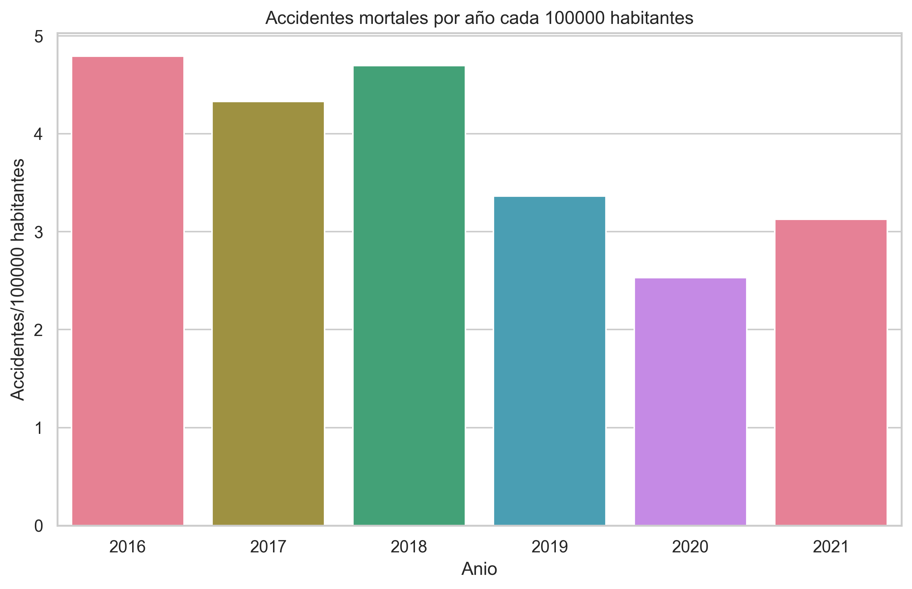
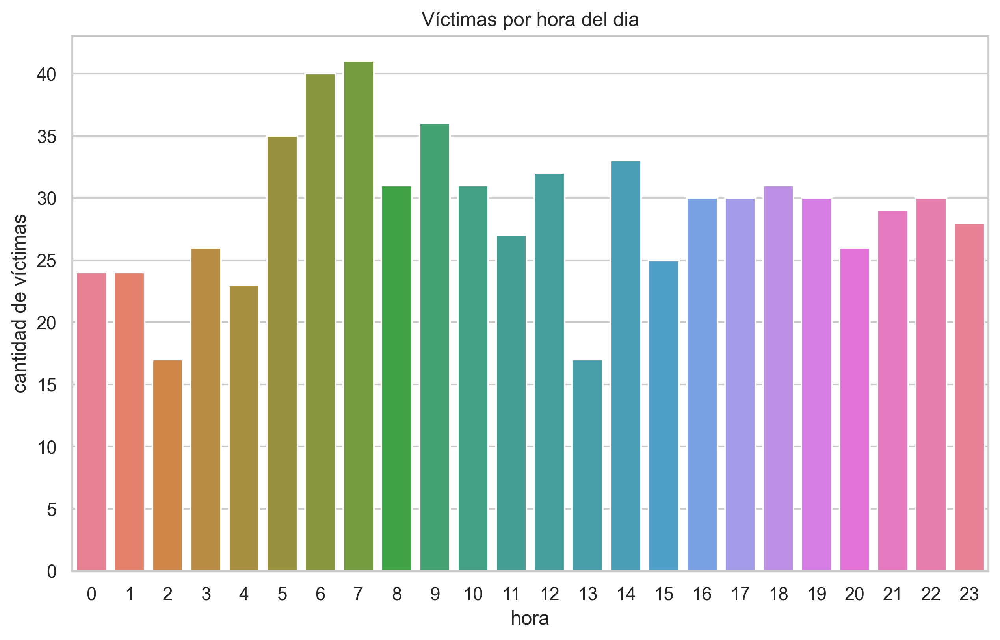
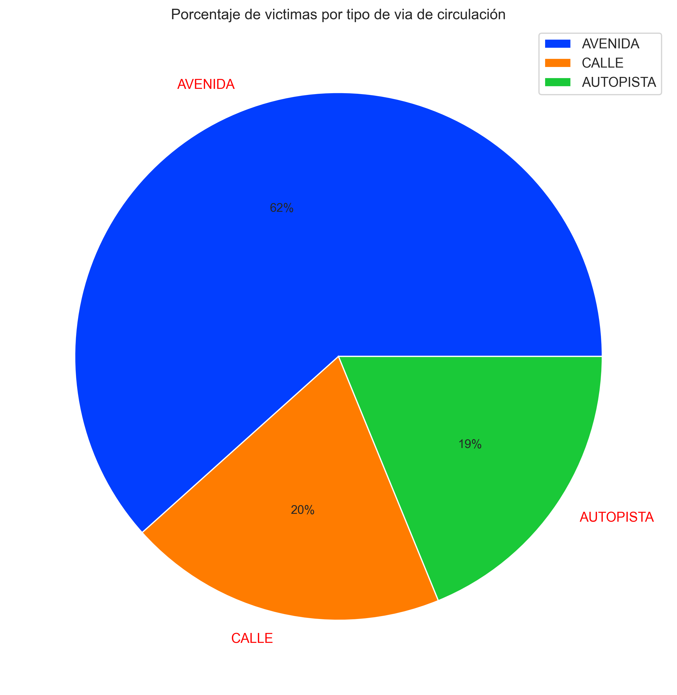
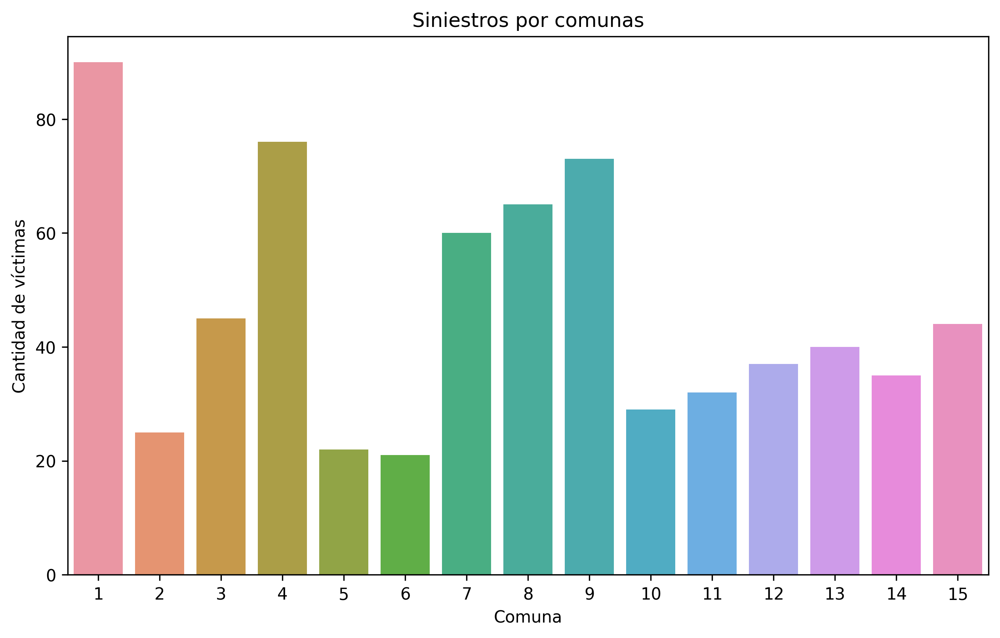
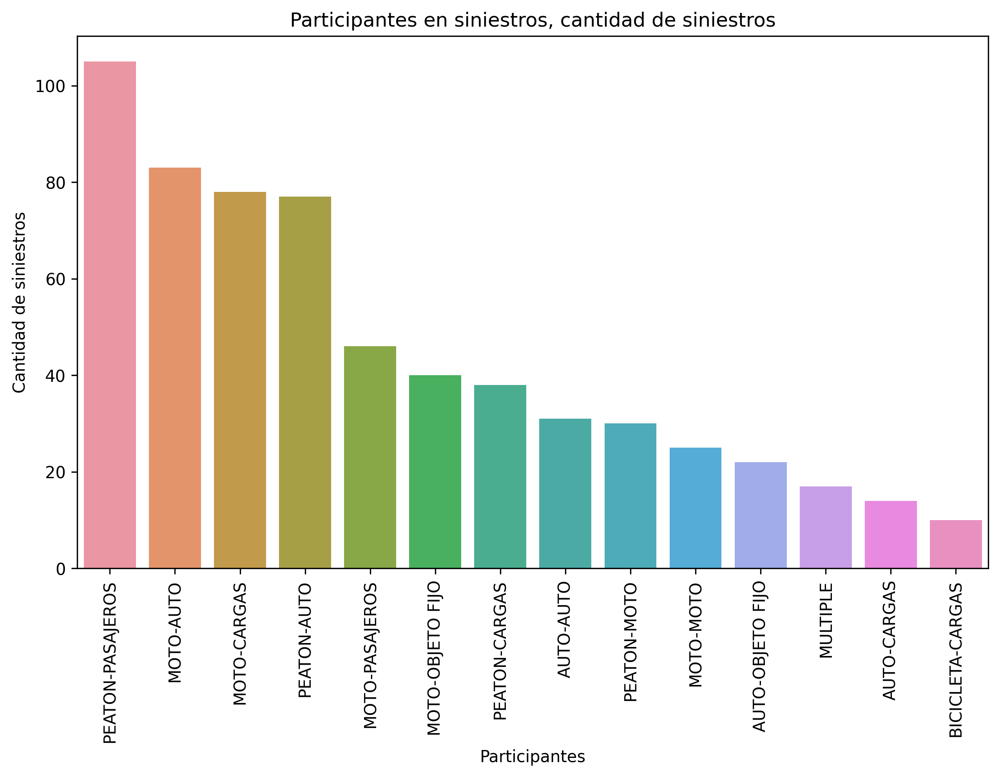
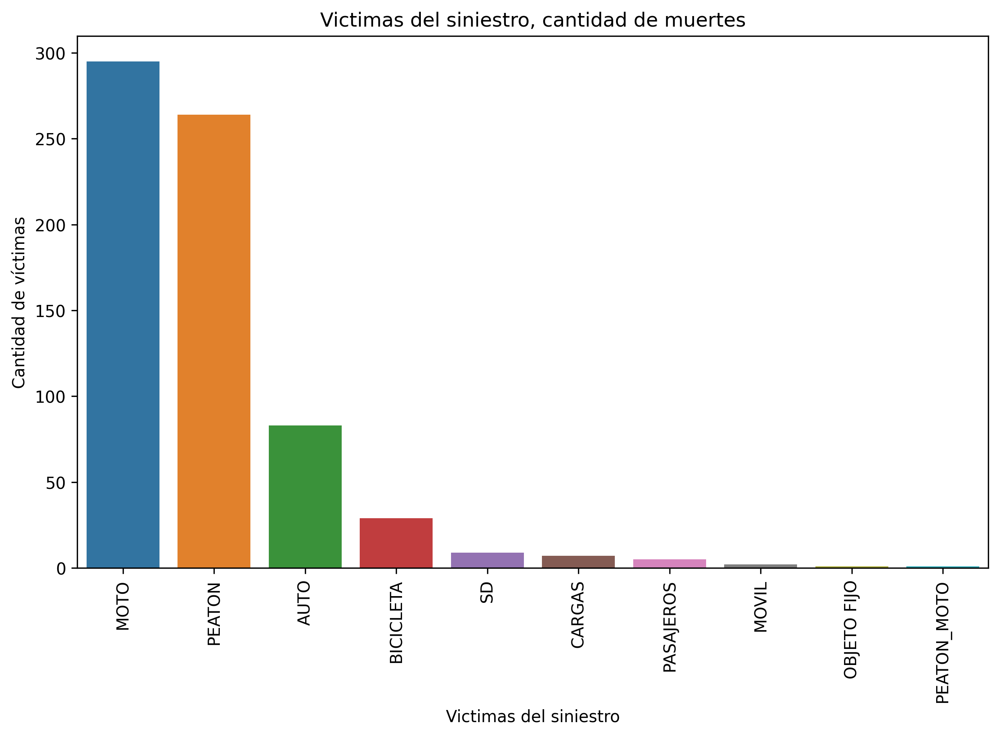
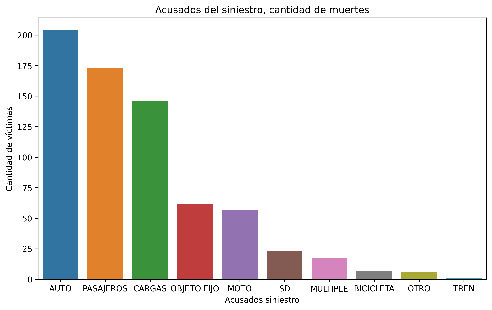
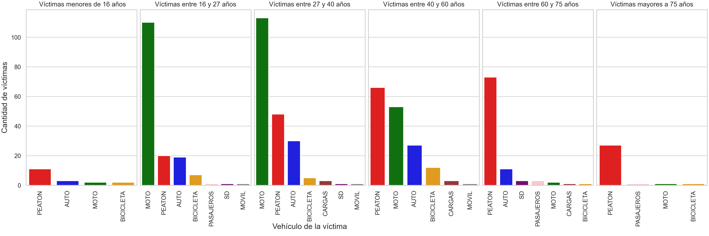

<h1>Accidentes de tránsito en la Ciudad de Buenos Aires, Argentina</h1>

Informe en base a datos extraidos de datos oficiales del Gobierno de la Ciudad durante el período Enero del 2016 a Diciembre del 2021

## Introducción
La ciudad de Buenos Aires es el principal conglomearado de la Argentina y en ella se producen a diario accidentes de tránsito que en muchos casos provocan víctimas fatales. La cantidad de transito que circula por ella no solo es debido a la población que en allí vive, sino que al ser la capital de la Republica Argentina, millones de personas provenientes del conurbano y de distintas localidades viajan a diario para trabajar, realizar trámites o desarrolar distintas actividades. En la ciudad no solo están los distintos ministerios, secreterarías y dependencias del gobierno, sino que la mayoría de las empresas tienen alli su cede central. 

En la Argentina es común el dicho "Dios está en todos lados, pero atiende en Buenos Aires", talvez ello explique el altisimo tránsito.

Dada la alta circulacion vehicular es de esperar un numero importante de siniestros de todo tipo. 

Este informe está basado en datos oficiales del Gobierno de la Ciudad y busca mostrar tendencias, patrones e información que permita hacer foco en disminuir los accidentes que se producen con mayor frecuencia y tienen mayor impacto en vidas.

## Datos:

Desde la [pagina](https://data.buenosaires.gob.ar/dataset/victimas-siniestros-viales) del gobierno, pueden descargarse datos de siniestros viales que provocaron lesiones, y homicidios en formato xlsx. En este trabajo se analiza solo el archivo **Homicidios (XLSX)**. Este archivo a su vez posee dos tablas, una llamada **hechos** y otra **victimas**. 

### Análisis de la tabla **hechos**

#### Número de siniestros segun cantidad de victimas registradas
Aunque para mayor detalle, se recomienda ingresar al archivo ETL y EDA, la mayor cantidad de víctimas fatales por accidente es de 3 siendo que en la mayoria de los accidentes se produjo una víctima unicamente.

#### segregación por dia de la semana.

Para el campo fecha, se contabilizan la cantidad de siniestros registrados por dias de la semana:

Si bien no hay mucha diferencia en cantidad de siniestros, el primer dia de la semana es cuando se producen la mayor cantidad de accidentes y podria entenderser que es por un mayor transito. 

EN los dias Sabado y Domingo se supone que hay menos transito por no ser dias laborables, por eso deberia estudiarse con mayor profundidad si estos accidentes son por actividades nocturnas.

#### segregación por mes del año.

Del mismo modo, puede verse la distribucion de los accidentes por meses del año. 

A priori, uno supondria que dado que en Enero el transito es menor que en los otros meses, podria esperar menor cantidad de accidentes, debera analizarse este punto con mayor profundidad. 

#### Accidentes fatales por año cada 100000 habitantes.

Utilizando informacion de los censos del 2010 y del 2022 respecto a la cantidad de poblacion de la Ciudad, se interpola la poblacion para calcular la poblacion en los años de analisis.

Puede verse una disminucion progresiva de los accidentes con victimas fatales a medida que pasan los años cada 100000 habitantes. Aun asi tener encuenta que durante los años 2020 y 2021 pero sobre todo 2020, el tránsito vehicular ha disminuido debido a las medidas de aislamiento  preventivo a causa del covid impulsadas por el gobierno nacional.

#### Víctimas por hora del dia

#### Accidentes por tipo de vía.

#### Siniestros en esquinas

De acuerdo a las definiciones del diccionario de los datos, en caso de que el siniestro se haya producido en una esquina, entonces en la columna 'Cruce' deberia verse el nombre de la calle. Puede deducirse entonces que si el registro en esa columna esta en NaN, el siniestro no se produjo entonces en una esquina. 

#### Cantidad de accidentes por comuna

En la Ciudad de Buenos Aires hay una división política por [comunas](https://buenosaires.gob.ar/comunas). En la planilla de hechos esta especificado en que comuna se produjeron.

#### Participantes del siniestro

En el diccionario definen al campo participantes como la conjunción de victima y acusado. Se muestra en el grafico de aqui abajo el la frecuencia de las distintas convinaciones de victima-acusado

#### Victimas del siniestro

Teniendo en cuenta el diccionario del archivo xlsx descargado de homicidios, las victimas se refiere al vehiculo que ocupaba la persona perjudicada.

La mayoria de las victimas en accidentes de transito son motociclistas y peatones.

No confundir con el apartado anterior, en donde se contabiliza la cantidad de siniestros de cada tipo y en donnde el siniestro pasajeros-peaton es el mas numeroso. Si se ve en esa misma seccion puede verse que el segundo tipo de siniestro y el tercero involucran a una moto.

#### Acusados del siniestro

Puede verse de nuevo aqui la relacion con los graficos anteriores en donde las motos y los peatones son las principales víctimas de los accidentes. Ahora bien, los acusados son los autos, vehiculos de pasajeros y de cargas.

## Analisis de la planilla **victimas**

Esta planilla tiene la informacion de cada victima de cada accidente registrado en la tabla de hechos. Se realiza un analisis similar de cada campo y la relacion entre ellos.

#### Rol de las victimas en el siniestro

Si se realiza un conteo, el rol que mayor ocupaban las victimas es el de conductor. Ahora bien, conductor tambien incluye a conductor de moto. 

De acuerdo al calculo realizado en el archivo EDA y ETL que forma parte de este directorio, 261 de 330 personas (aprox 80 %) conductoras fallecidas, pertenecian a conductores de moto.

#### Rango etario de las víctimas y vechiculo que ocupaban en el accidente

Se grafica segun rango etario, los vehiculos ocupados por las victimas en el accidente (incluido peatones)

(pido disculpas este grafico no pudo cargarse correctamente, dirigirse al EDA y ETL para verlo.)

En este gráfico puede verse las victimas segun el rango etario. En el rango de 16 a 27 años ("adolescentes") puede verse la gran diferencia de la principal causa de muerte respecto al rango que sigue de 27 a 40 años. Si bien en ambos es la moto, en el segundo caso la diferencia con respecto a peaton y a auto es mucho menor. Ya en el rango de 40 a 60 puede verse que la moto deja de ser el vehiculo que tiene mayor numero de muertes.